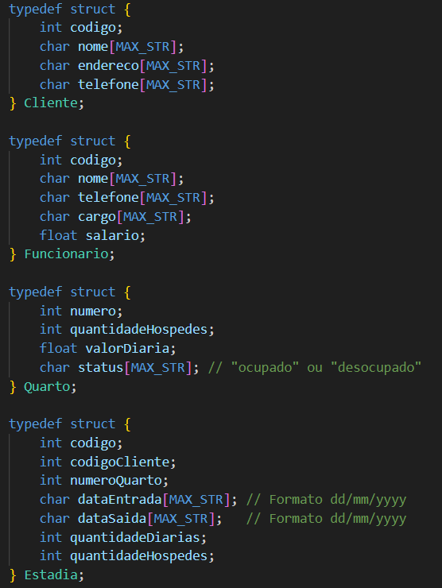
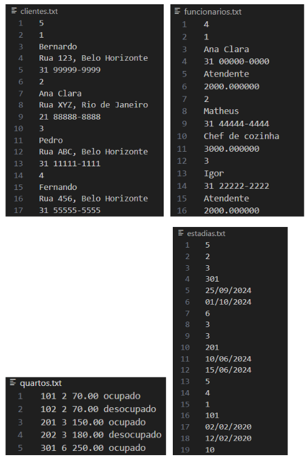
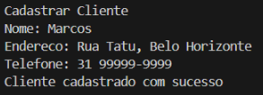
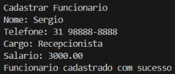
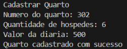
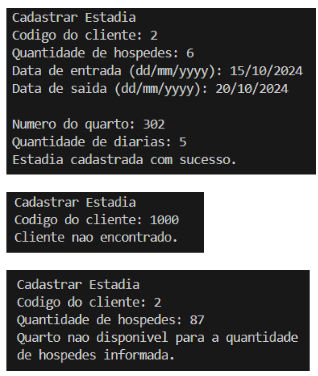
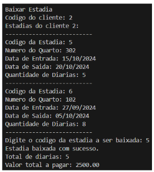
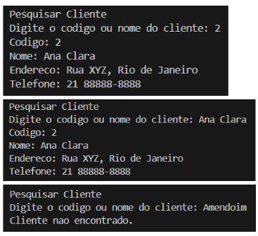
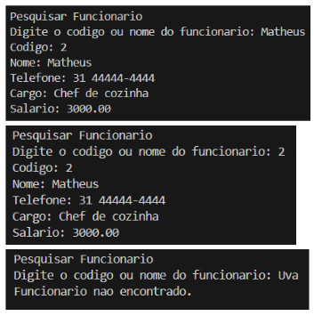
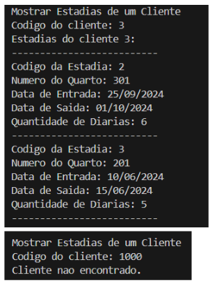

# Sistema de Gestão de Hotel - Hotel Descanso Garantido

Nome: Matheus Santos Gomes
Matrícula: 629910

Nome: Victor Sverberi Maia
Matrícula: 832328

## Descrição

Este é um sistema de gestão para um hotel fictício chamado "Hotel Descanso Garantido". O sistema permite o cadastro de clientes, funcionários, quartos e estadias, além de realizar consultas e baixar estadias. A seguir, uma explicação detalhada sobre cada funcionalidade.

## Funcionalidades

### Menu

- **Descrição**: Permite ao usuário escolher uma funcionalidade do sistema.
- **Estrutura**:
  ```
  --- Hotel Descanso Garantido ---
  1. Cadastrar Cliente
  2. Cadastrar Funcionario
  3. Cdastrar Quarto
  4. Cadastrar Estadia
  5. Baixar Estadia
  6. Pesquisar Cliente
  7. Pesquisar Funcionario
  8. Mostrar Estadias de um Cliente
  9. Sair
  Escolha uma opcao: _
  ```

### Cadastrar Cliente

- **Função:** `void cadastrarCliente()`
- **Parâmetros:** Nenhum
- **Descrição:** Realiza o cadastro de um novo cliente. Solicita nome, endereço e telefone. Gera um código único para o cliente com a função `gerarCodigo(FILENAME_CLIENTES)` e salva os dados em no arquivo de texto `clientes.txt` com a função `salvarCliente(cliente)`.

### Cadastrar Funcionário

- **Função:** `void cadastrarFuncionario()`
- **Parâmetros:** Nenhum
- **Descrição:** Realiza o cadastro de um novo funcionário. Solicita as informações nome, telefone, cargo e salário. Gera um código único para o funcionário chamando a função `gerarCodigo(FILENAME_FUNCIONARIOS)` e salva os dados em um arquivo de texto `funcionarios.txt` com a função `salvarFuncionario(funcionario)`.

### Cadastrar Quarto

- **Função:** `void cadastrarQuarto()`
- **Parâmetros:** Nenhum
- **Descrição:** Realiza o cadastro de um novo quarto. Solicita informações como número do quarto, quantidade de hóspedes e valor da diária. Inicializa o status do quarto como "desocupado" e salva os dados em um arquivo de texto.

### Cadastrar Estadia

- **Função:** `void cadastrarEstadia()`
- **Parâmetros:** Nenhum
- **Descrição:** Realiza o cadastro de uma nova estadia.
- **Funcionamento:**
  - Solicita o código do cliente e verifica se ele existe.
    - Caso o cliente não exista, informa ao usuário e termina a ação.
  - Solicita a quantidade de hóspedes e verifica a disponibilidade de quartos.
    - Caso não exista nenhum quarto disponível para aquela quantidade de hóspedes, informa o usuário e termina a ação.
  - Solicita as datas de entrada e saída, e calcula a quantidade de diárias chamando `calcularDiarias(dataEntrada, dataSaida)`.
  - Atualiza o status do quarto para "ocupado".
  - Gera um código único para a estadia chamando `gerarCodigo(FILENAME_ESTADIAS)`.
  - Salva os dados da estadia no arquivo `estadias.txt` utilizando a função `salvarEstadia(estadia)`.
  - Mostra ao usuário que a estadia foi cadastrada com sucesso, o número do quarto da estadia e a quantidade de diárias.

### Baixar Estadia

- **Função:** `void baixarEstadia()`
- **Parâmetros:** Nenhum
- **Descrição:** Realiza o checkout de uma estadia.
- **Funcionamento:**
  - Solicita o código do cliente e verifica se ele existe.
    - Caso o cliente não exista, informa ao usuário e termina a ação.
  - Exibe todas as estadias associadas ao cliente.
  - Solicita o código da estadia a ser baixada.
  - Calcula e mostra o valor total da estadia (quantidade de diárias \* valor da diária do quarto).
  - Atualiza o status do quarto para "desocupado".
  - Remove a estadia do arquivo `estadias.txt`.

### Pesquisar Cliente

- **Função:** `void pesquisarCliente()`
- **Parâmetros:** Nenhum
- **Descrição:** Permite a pesquisa de um cliente pelo código ou pelo nome.
- **Funcionamento:**
  - Solicita ao usuário o código ou nome do cliente.
    - Caso o cliente ou código não exista, informa ao usuário e termina a ação.
  - Busca o cliente no arquivo `clientes.txt` e exibe suas informações se encontrado.
  - Exibe as informações do cliente encontrado.

### Pesquisar Funcionário

- **Função:** `void pesquisarFuncionario()`
- **Parâmetros:** Nenhum
- **Descrição:** Permite a pesquisa de um funcionário pelo código ou pelo nome.
- **Funcionamento:**
  - Solicita ao usuário o código ou nome do funcionário.
    - Caso o funcionário ou código não exista, informa ao usuário e termina a ação.
  - Busca o funcionário no arquivo `funcionarios.txt` e exibe suas informações se encontrado.
  - Exibe as informações do funcionário encontrado.

### Mostrar Estadias de um Cliente

- **Função:** `void mostrarEstadiasCliente()`
- **Parâmetros:** Nenhum
- **Descrição:** Exibe todas as estadias associadas a um cliente.
- **Funcionamento:**
  - Solicita o código do cliente.
  - Verifica se o cliente existe.
  - Exibe todas as estadias associadas ao cliente.

## Geração de IDs

A geração de IDs é feita através da função `gerarCodigo(char *filename)`. Esta função abre o arquivo correspondente (clientes.txt, funcionarios.txt, estadias.txt) e lê o último código usado, que está guardado na primeira linha de cada arquivo. Em seguida, incrementa o código e o salva novamente no início do arquivo para que o próximo uso gere um código único e sequencial.

## Estrutura do Projeto

### Estrutura de Dados

O sistema utiliza as seguintes estruturas de dados:



### Arquivos de Dados

O sistema utiliza arquivos de texto para armazenar os dados de clientes, funcionários, quartos e estadias:

- `clientes.txt`: Armazena informações dos clientes.
- `funcionarios.txt`: Armazena informações dos funcionários.
- `quartos.txt`: Armazena informações dos quartos.
- `estadias.txt`: Armazena informações das estadias.

### Formato dos Arquivos

- **clientes.txt**

```
último código usado
código1
nome1
endereço1
telefone1
código2
...
```

- **funcionarios.txt**

```
último código usado
código1
nome1
telefone1
cargo1
salário1
código2
...
```

- **quartos.txt**

```
númeroQuarto1 quantidadeHospedes1 valorDiária1 status1
númeroQuarto2 quantidadeHospedes2 valorDiária2 status2
...
```

- **estadias.txt**

```
último código usado
código1
códigoCliente1
númeroQuarto1
dataEntrada1
dataSaída1
quantidadeDiárias1
código2
...
```

Exemplo:



## Bibliotecas Utilizadas

- **stdio.h:** Utilizada para operações de entrada e saída (printf, scanf, fopen, fclose, etc).
- **stdlib.h:** Utilizada para alocação de memória e outras funções utilitárias.
- **string.h:** Utilizada para manipulação de strings (strcpy, strcasecmp, etc).

## Saídas Esperadas

As saídas esperadas do sistema são mensagens de confirmação para operações bem-sucedidas, mensagens de erro para entradas inválidas e exibição de dados solicitados nas funções de pesquisa e listagem.

## Casos de Teste

### Cadastro de Cliente



### Cadastro de Funcionário



### Cadastro de Quarto



### Cadastro de Estadia



### Baixar Estadia



### Pesquisar Cliente



### Pesquisar Funcionário



### Mostrar as Estadias de um Cliente


